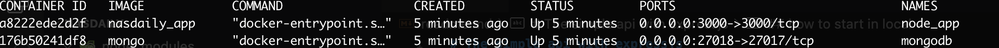

# The simple api with expressjs
- this only demo for interview job

## how to start in local
- install docker & docker-compose in locally first
- clone source from git then `cd` to root folder
- start server by command
```sh
docker-compose up --build -d
```
- then wait done build then start test api via postman tool
- check docker working by command `docker ps` then can see then same 
  

## call apis
- for car then use prefix `http://localhost:3000/api/car`
  - `/init` => insert list data into mongodb for test
  - `/` => get all cars in db
  - `/:id` => get one car item via carId
- for slot then use prefix `http://localhost:3000/api/slot`
  - `/init` => insert list data into mongodb for test
  - `/` => get all slots in db
  - `/:id` => get one slot item via slotId
- for check both slot & car in one api with `id`
  - `http://localhost:3000/api/both/:id` => get one item is car or slot


## change config
- if you want to change then open file `.env` then update value and rebuild docker images again then start test


## support
- can make any questions or anythin for me via email [Long Nguyen](mailto:nguyenchilong90@gmail.com)
- can add my skype `nguyenchilongphp`
- can use other channel such as whatsapp/viber/telegram/etc via this phone number `+84(0)768994959`